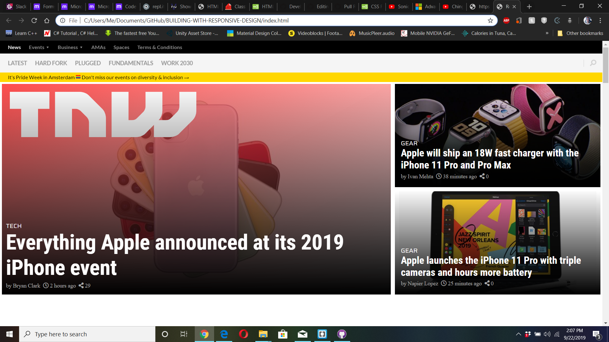
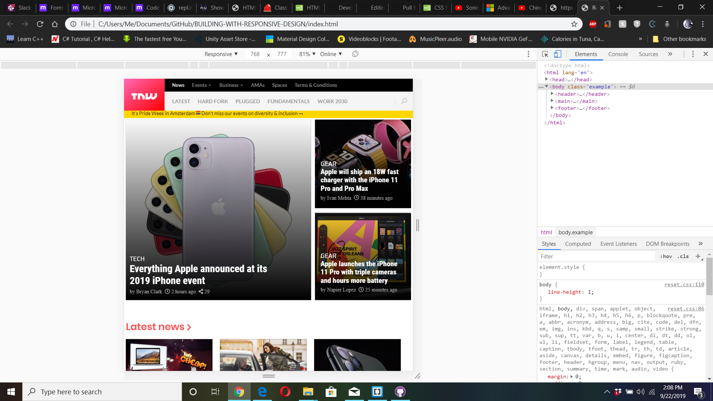
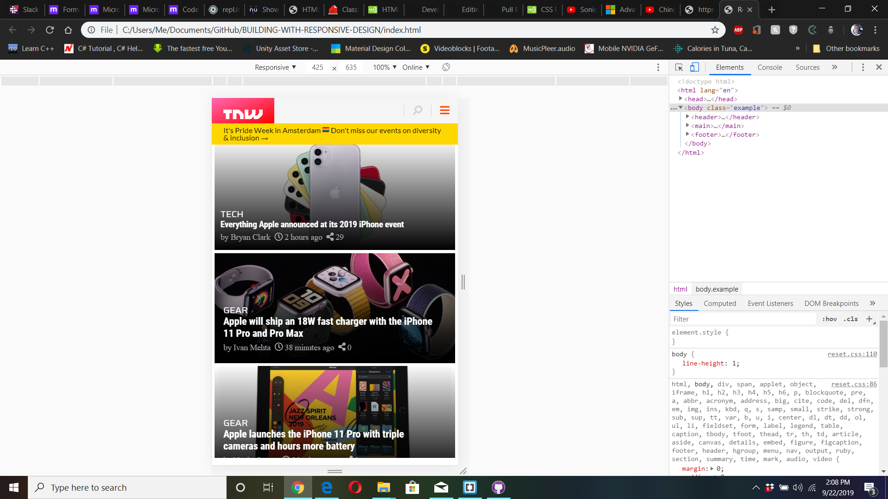

# (- PROJECT: Building with Responsive Design - )
In this project, you’ll get the chance to build a responsive website. We’ll be cloning The Next Web, a tech-focused magazine which uses media queries to gracefully degrade their site as the window size is reduced. You can find the original project specification at: https://www.theodinproject.com/courses/html5-and-css3/lessons/building-with-responsive-design

## Author: 
### Aaron
Aaron's Github Profile: https://github.com/Aaron-RN

## Github Link
Github Link: https://github.com/Aaron-RN/Building-With-Responsive-Design

## Live Link
https://raw.githack.com/Aaron-RN/BUILDING-WITH-RESPONSIVE-DESIGN/Development/index.html
https://raw.githack.com/Aaron-RN/BUILDING-WITH-RESPONSIVE-DESIGN/master/index.html

# Images

